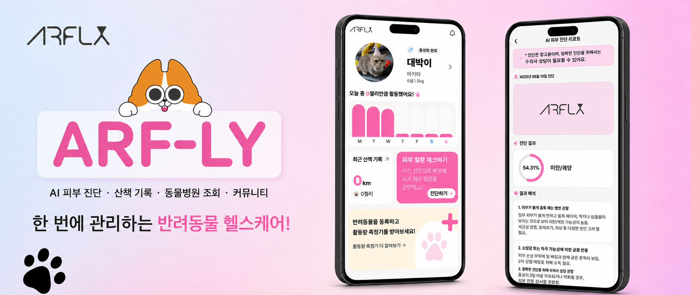
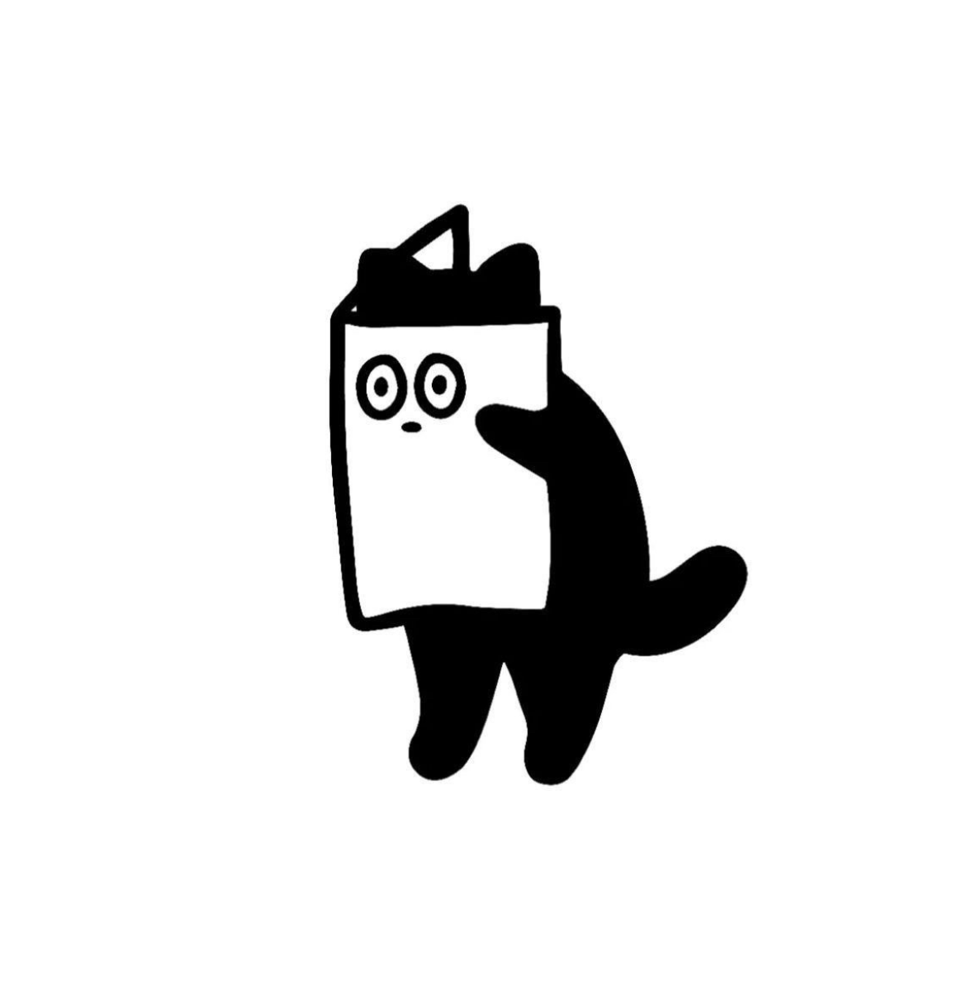
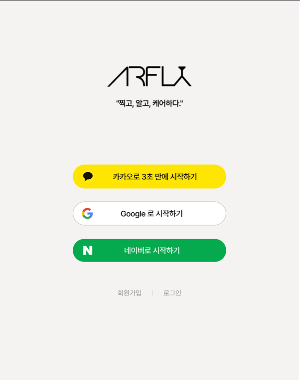
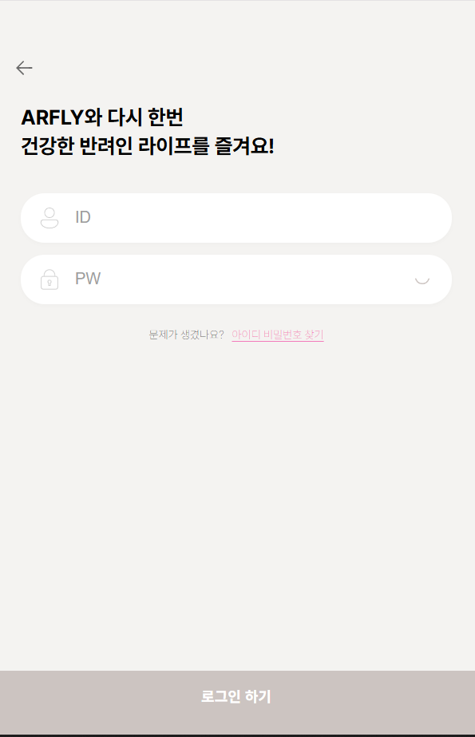
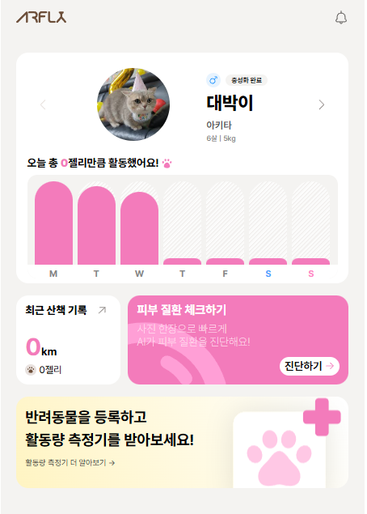
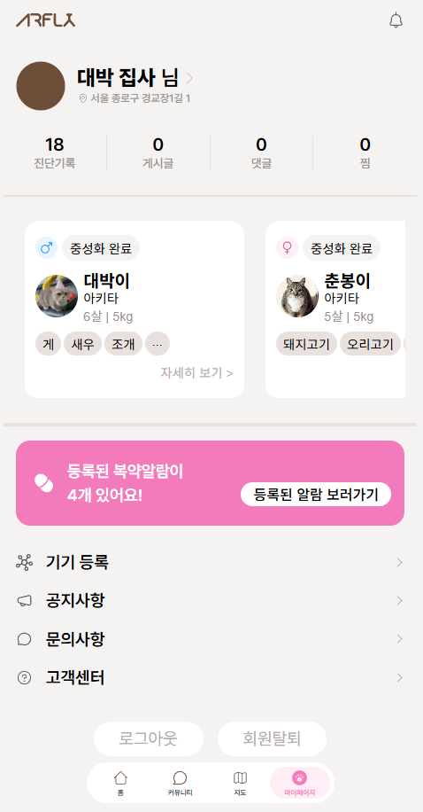
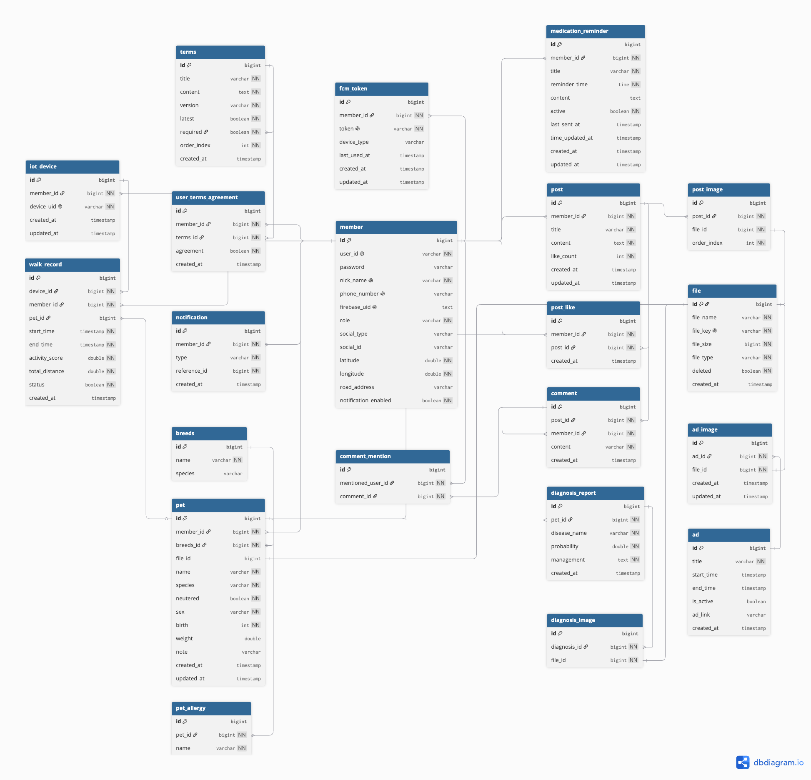
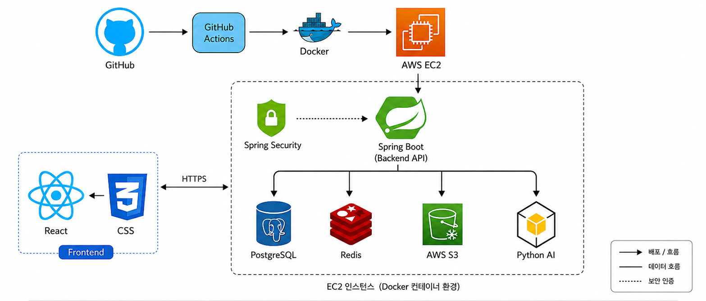

# Arf-ly - AI·IoT 기반 반려동물 헬스케어 플랫폼

 

  

 

## 프로젝트 기간

**2025년 03월 ~ 진행 중**

## 배포

**[Arf-ly 접속하기](https://arf-ly-web.vercel.app/)**

## 팀 구성

<table>
  <tr>
    <td align="center">
      <a href="https://github.com/SHNAME">
         
         이시형 (Back-End/팀장)
      </a>
    </td>
    <td align="center">
      <a href="https://github.com/jangseheon">
         
        장세헌 (Back-End)
      </a>
    </td>
    <td align="center">
      <a href="https://github.com/kang-bs">
         
        강보성 (Back-End)
      </a>
    </td>
    <td align="center">
      <a href="https://github.com/kayeong97">
         
        김가영 (Front-End/AI)
      </a>
    </td>
  </tr>
  <tr>
    <td align="center">
      인증 시스템 소셜 로그인 커뮤니티 FCM 푸시 알림 IoT 도메인·산책 기록
    </td>
    <td align="center">
      병원 조회 AI 피부 진단 진단 리포트·기록 조회
    </td>
    <td align="center">
      반려동물·회원 관리 S3 파일 업로드 IoT 기기 연결 CI/CD
    </td>
    <td align="center">
      AI 진단 온보딩 로그인·회원가입 AI 모델 학습 Python 서버 구축
    </td>
  </tr>
  <tr>
    <td align="center">
      <a href="https://github.com/wnwngud">
         
        서주형 (Front-End/IoT)
      </a>
    </td>
    <td align="center">
      <a href="https://github.com/eegnim">
         
        김민지 (Front-End)
      </a>
    </td>
    <td align="center">
      <a href="#">
         
        김소윤 (Design)
      </a>
    </td>
    <td align="center">
      <a href="#">
         
        진정한 (Design)
      </a>
    </td>
  </tr>
  <tr>
    <td align="center">
      메인 페이지 IoT 대시보드 IoT HW·SW 개발
    </td>
    <td align="center">
      커뮤니티 페이지 동물병원 지도 페이지
    </td>
    <td align="center">
      UI/UX 디자인
    </td>
    <td align="center">
      UI/UX 디자인
    </td>
  </tr>
</table>

## 서비스 소개

Arf-ly는 **AI 피부 질환 진단**과 **IoT 웨어러블 기기**를 결합한 반려동물 통합 헬스케어 플랫폼입니다.
반려동물의 피부 이상 증상을 사진 한 장으로 AI가 분석하고, IoT 기기로 산책 데이터를 자동 수집합니다.
피부 진단 · 산책 기록 · 동물병원 조회 · 커뮤니티를 하나의 서비스에서 제공합니다.

## 핵심 기능

| 기능          | 설명                                                       |
|-------------|----------------------------------------------------------|
| AI 피부 질환 진단 | 반려동물 피부 사진을 업로드하면 AI가 질환 가능성을 분석하고 맞춤형 관리 리포트를 제공        |
| IoT 산책 기록   | Raspberry Pi Pico W + GPS + 가속도 센서로 산책 중 활동량·이동 경로 자동 수집 |
| 반려동물 관리     | 반려동물 정보 등록 및 AI 진단·산책 기록을 통합 관리                          |
| 동물병원 조회     | 등록 주소 기반 주변 동물병원 목록 및 상세 정보 제공                           |
| 커뮤니티        | 반려동물 건강 관련 고민과 경험을 다른 보호자와 공유                            |

## 서비스 화면

### 로그인

<table width="100%">
  <tr>
    <td align="left"></td>
    <td align="right"></td>
  </tr>
  <tr>
    <td align="center">시작 화면</td>
    <td align="center">일반 로그인</td>
  </tr>
</table>

### 메인

<table width="100%">
  <tr>
    <td align="left"></td>
    <td align="right"></td>
  </tr>
  <tr>
    <td align="center">메인 화면</td>
    <td align="center">AI 진단 결과 리스트</td>
  </tr>
</table>

### AI 피부 질환 진단

<table width="100%">
  <tr>
    <td align="left"></td>
    <td align="right"></td>
  </tr>
  <tr>
    <td align="center">동물 선택</td>
    <td align="center">진단 결과 리포트</td>
  </tr>
</table>

### 산책 대시보드

<table width="100%">
  <tr>
    <td align="left"></td>
    <td align="right"></td>
  </tr>
  <tr>
    <td align="center">활동점수</td>
    <td align="center">산책 거리</td>
  </tr>
</table>

### 동물병원 지도

<table width="100%">
  <tr>
    <td align="left"></td>
    <td align="right"></td>
  </tr>
  <tr>
    <td align="center">동물병원 리스트</td>
    <td align="center">동물병원 상세 정보</td>
  </tr>
</table>

### 커뮤니티

<table width="100%">
  <tr>
    <td align="left"></td>
    <td align="right"></td>
  </tr>
  <tr>
    <td align="center">커뮤니티 리스트</td>
    <td align="center">커뮤니티 상세 정보</td>
  </tr>
</table>

### 마이페이지

<table width="100%">
  <tr>
    <td align="left"></td>
    <td align="right"></td>
  </tr>
  <tr>
    <td align="center">마이페이지</td>
    <td align="center">복약 알림 서비스</td>
  </tr>
</table>

## 기술 스택

**Backend**

**AI**

**Frontend**

**IoT**

**Infra**

**문서 작성**

**협업 툴**

**디자인 및 설계**

**버전 관리**

## ERD

  

## 아키텍처

  

## 프로젝트 파일 구조

<b>Backend</b>

<pre>
src
  └─ main
       └─ java
            └─ com.capstone.arfly
                 ├─ ad
                 │    └─ domain
                 ├─ common
                 │    ├─ auth
                 │    ├─ config
                 │    ├─ constant
                 │    ├─ domain
                 │    ├─ dto
                 │    ├─ exception
                 │    └─ util
                 ├─ community
                 │    ├─ controller
                 │    ├─ domain
                 │    ├─ dto
                 │    ├─ repository
                 │    └─ service
                 ├─ diagnosis
                 │    ├─ controller
                 │    ├─ domain
                 │    ├─ dto
                 │    ├─ repository
                 │    └─ service
                 ├─ hospital
                 │    ├─ controller
                 │    ├─ dto
                 │    └─ service
                 ├─ iot
                 │    ├─ controller
                 │    ├─ domain
                 │    ├─ dto
                 │    ├─ repository
                 │    └─ service
                 ├─ member
                 │    ├─ controller
                 │    ├─ domain
                 │    ├─ dto
                 │    ├─ repository
                 │    └─ service
                 ├─ notification
                 │    ├─ controller
                 │    ├─ domain
                 │    ├─ dto
                 │    ├─ repository
                 │    └─ service
                 ├─ pet
                 │    ├─ controller
                 │    ├─ domain
                 │    ├─ dto
                 │    ├─ repository
                 │    └─ service
                 └─ walkRecord
                      ├─ controller
                      ├─ domain
                      ├─ dto
                      ├─ repository
                      └─ service
</pre>

<b>Frontend</b>

<pre>
src
  ├─ assets
  │    ├─ bottom_tab_bar
  │    ├─ community
  │    ├─ home
  │    │    ├─ Camera
  │    │    ├─ diseaseCheck
  │    │    ├─ walkedResult
  │    │    └─ weeklyActive
  │    ├─ login
  │    │    ├─ social
  │    │    └─ system
  │    ├─ map
  │    ├─ mypage
  │    │    ├─ IotRegistration
  │    │    ├─ MedicineAlarm
  │    │    ├─ PetDetail
  │    │    └─ UserProfile
  │    ├─ pet
  │    │    └─ register
  │    └─ terms
  ├─ components
  │    └─ BottomTabBar
  ├─ pages
  │    ├─ auth
  │    │    ├─ Find
  │    │    ├─ Login
  │    │    └─ Signup
  │    ├─ community
  │    ├─ home
  │    │    └─ data
  │    ├─ map
  │    ├─ mypage
  │    │    ├─ data
  │    │    └─ IotRegisteration
  │    └─ pet
  ├─ style
  ├─ App.jsx
  ├─ firebase.js
  ├─ index.css
  └─ main.jsx
</pre>

